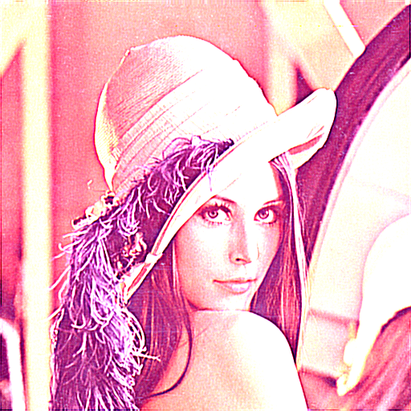

# convolution
Convolution filters in golang

Filter                    | Resize result
--------------------------|---------------------------------------------
`getIdentityFilter` |  
`getEdgeFilter1` |  
`getEdgeFilter2` |  
`getEdgeFilter3` |  
`getEdgeFilter4` |  
`getEmboss` |  
`getEmboss2` |  
`getBlur` |  
`getBlur2` |  
`getEdge` |  
`getExcessiveEdge` |  
`getSharpen` |  
